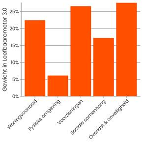

# data checklist:
### High:
- [x] Crime rate per 1000 in neighbourhood 
- [x] QoL of neighbourhood 
- [ ] Number of reported crimes / confirmed crimes
- [ ] Number of BOA in neighbourhood

### Medium:
- [ ] Events dates and location
- [ ] Home attractiveness in neighbourhood
- [x] Education in neighbourhood
- [x] Income in neighbourhood
- [x] Liveability score

### Low:
- [X] Green index
- [x] Population of neighbourhood

# leefbaarometer 3.0 dimension contribution:
- woningvoorraad - housing stock
- fysieke omgeving - physical environment
- voorzieningen - services
- sociale samenhang - social cohesion
- overlast en onveiligheid - nuisance and insecurity

## data:
- Bevolking naar leeftijd en geslacht - Buurten van Gemeente Breda.csv -> Population of neighbourhood by age, gender
- Misdrijven_per_wijk_en_buurt_per_maand_15052023_134652.csv -> Crime rate by type of crime and neighbourhood
- Totaalscore Leefbaarometer 3.0 - Buurten van Gemeente Breda.csv -> QoL by neighbourhood
- Huishoudens met een - Buurten van Gemeente Breda.csv -> % of households with low and high income by neighbourhood
- Buurten.geojson -> Shape and location of neighbourhoods
- Opleidingsniveau 15-75-jarigen - - Buurten van Gemeente Breda.csv -> amount of people with education on level low/medium/high in neighbourhood in age between 15-75

## questions:
ask Nittin if the municipality has data on unemployment 
ask if there is more data on educatio

## TO-DO:
- trend of niusance, theft of vehicles/bikes, bulglary in a year

